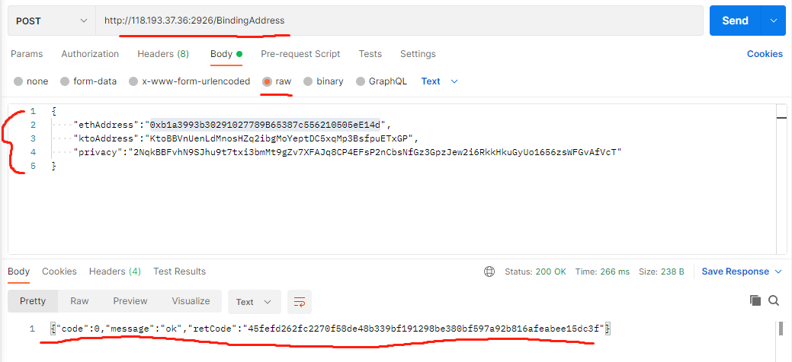
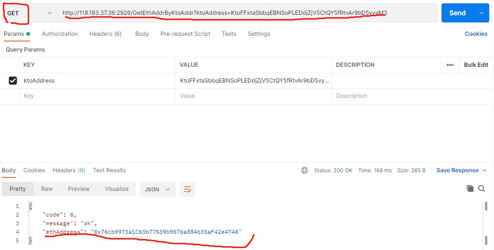

# 用户KTO10地址绑定以太坊地址
用户在korthochain上部署智能合约，首先需要把自己的kto地址和一个以太坊地址绑定。用户需要发送一条绑定地址的http请求,发送请求之前必须保证用户地址至少有0.1个KTO余额.

## 一、发送绑定请求
    1、使用postman发送POST请求到 http://118.193.37.36:2926/BindingAddress ：

    
    2、使用curl命令发送：
    curl -i -X POST -H "'Content-type':'application/json'" -d '{"ethAddress":"0x76cb9973a1C63b77539b9576a884b35aF42e4740","ktoAddress":"KtoFFxtaSbbqEBNSoPLEDdjZjV5CtQY5fRtvAr9bD5vyaM3","privacy":"3p7xacGL3yeo65bguWQ8417cBfGbFozwRU5PdH1tLKQS8LnxSicFWu1mmmh1H6avzW5GrgDGzFuUSr9VF1vTVoU9"}' http://118.193.37.36:2926/BindingAddress

    注：
    {
        "ethAddress":"要绑定的eth地址",
        "ktoAddress":"自己的用户kto地址",
        "privacy":"用户kto地址私钥"
    }
    绑定成功返回：{"code":0,"message":"ok","retCode":"绑定hash"}

## 二、查询绑定
    1、使用postman发送GET请求到 http://118.193.37.36:2926/GetEthAddrByKtoAddr ：

    2、curl命令：
    curl http://118.193.37.36:2926/GetEthAddrByKtoAddr?ktoAddress=KtoFFxtaSbbqEBNSoPLEDdjZjV5CtQY5fRtvAr9bD5vyaM3